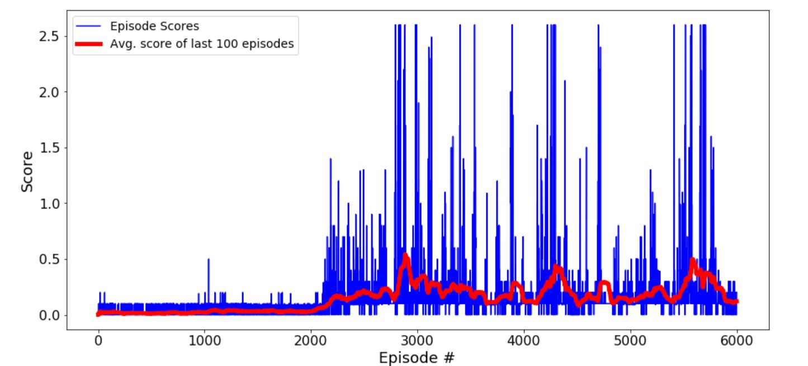

# Collaborate and Compete – Tennis Project

## Implementation of the Multi-Agent Reinforcement Learning Algorithm


### Networks

Actor model:


Critic Model:


### Algorithm

I have named my Multi-Agent clas as Parent. When an instance of Parent is created, it creates a 2-Agent DDPG agent as follows:
```
self.madagents = [ddpg.ddpg(24, 2, 256, 128 , 64 ), ddpg.ddpg(24, 2, 256, 128, 64)]

```
Each DDPG agent has two actor models(local and target) and two critic models(local and target). During an episode, the environment generates two states(one for each agent). These states are fed to the parent agent to generate respective actions of each DDPG agent.
If there are enough experiences in the buffer memory(more than the batch size) then the parent agent samples batch size memories for each agent, so that it can learn and update its actor and critic local networks.

Updating the networks:


Each DDPG agent updates its local actor and critic networks during every update step of the parent agent. The update algorithm for a DDPG agent, say agent_0, is as folows:
- Computing the Advantage function:
  - The sampled next_states of both agents are fed to their current version of actor_target models to generate next_actions after
    next_states.
  - The next_actions are concatenated with next_states and fed to the critic_target model of agent_0 to generate action_value, Q_next       given next_states and next_actions.
  - The Advantage function is computed as rewards(for agent_0 for taking actions after observing states) + gamma * Q_next.
  
    Hence Q_next acts like the cumulative reward for next_states.
   
- Training the critic_local model:
  - states and actions sampled are concatenated and fed to the current version of critic_local model of agent_0 to predict Q_expected       for states.
  
  - The critic_local model of agent_0 is then trained such that Q_expected matches the Advantage function. The difference in their           values is computed as the mean squared error loss and the critic_local network is optimized using Adam optimizer.
    
- Training the actor_local model:
  - The sampled states for both agents are fed to their current version of the actor_local model to predict actions,say actions_pred,       for both agents.
  
  - These actions_pred are concatenated with states and fed to the current version of critic_local model of agent_0 to compute               Q_current.
  
  - The actor_local model of agent_0 is then optimized by minimizing the value -1* Q_current, in other words by maximizing Q_current.       Again I used Adam optimizer.
    
- Soft Updating the Target Networks:

  The actor_target and critic_target networks of agent_0 are soft_updated to gradually match their repective local networks.
  
The same steps are followed for the second agent as well.

### Randomness

The OU Noise that is usually added to actions to generate more random states wasn't exploratory enough for this environment. Hence I made the actions 100% random by modifying a uniform distribution (0,1] to (-1 ,1] and randomly sampling actions from this distribution. This helped generate random consecutive states and made the algorithm much more exploratory.


### Attempts

1. In the first attempt, I set the randomness to 100% for first 1000 episodes and 50% until 2000 episodes, updated the networks every 2 time steps and didn't set any limit on the number of time steps per episode. The result was as follows,



The environment was solved but was unstable. The maximum average score per 100 episodes was +0.543.

2. In the scond attempt, I kept all parameters the same but updated the networks every time step. 


As expected, the environment was solved with much higher score, but was also more unstable.The maximum average score per 100 episodes was +0.890.

3. In the third attempt, in order to make the algorithm more stable, I decided to update the networks less often. Hence I updated the network every 2 time steps and limited the number of time steps per episode to 1000. To compensate for less often training, I increased the exploratory characteristics of the agents by selecting actions with 100% randomness for first 1500 epsiodes and 50% from thereafter until 2500 episodes. The results were as follows,


### Evaluation


 the stable model, decide why chosen , show gifs.
 
 ### Future work
  
  change limited steps, try out other algos like PPO etc.


